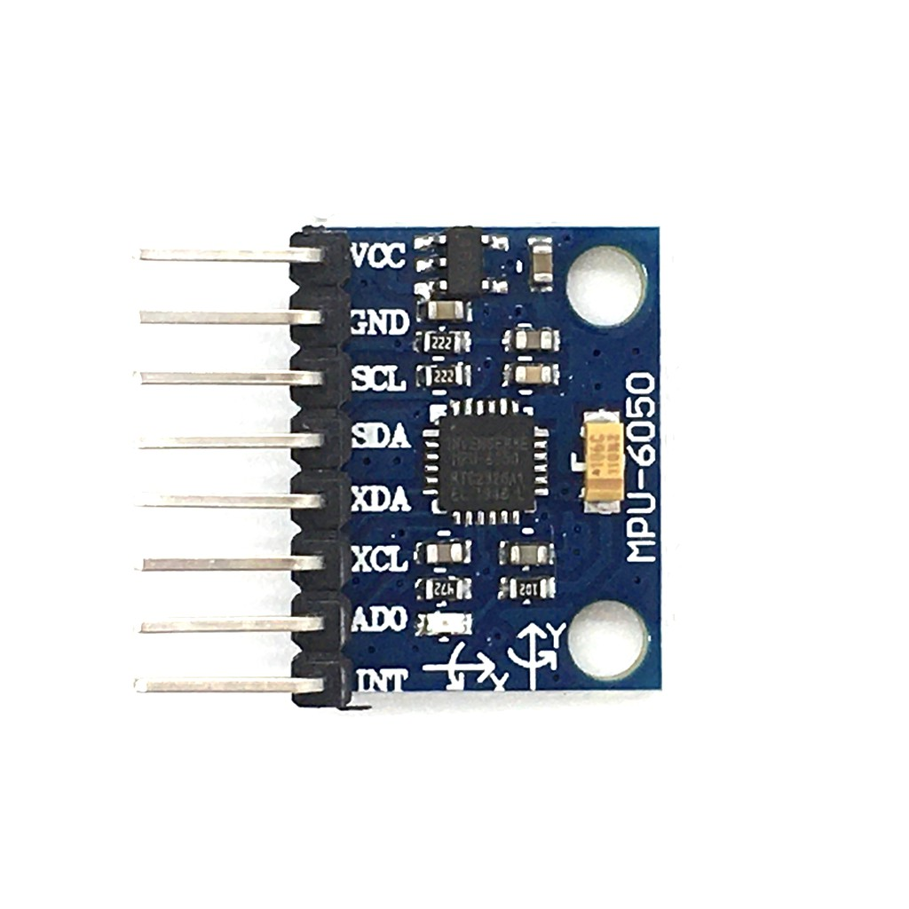
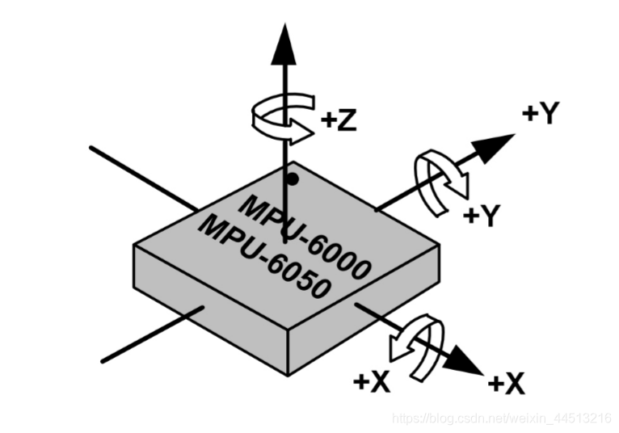
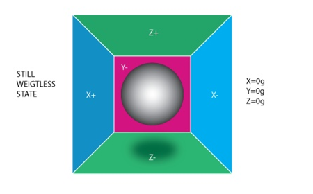
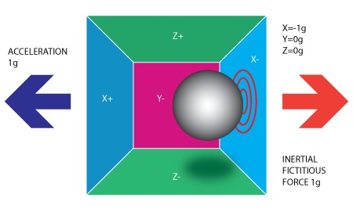
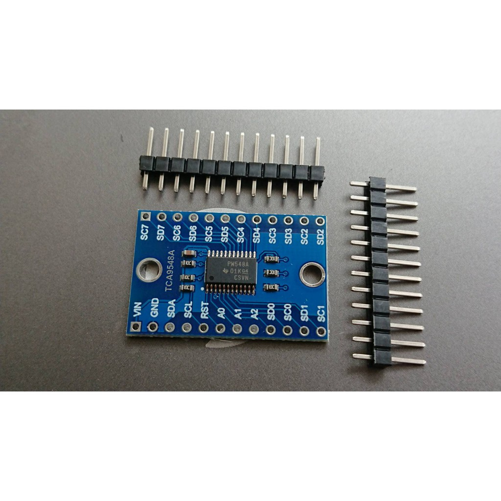
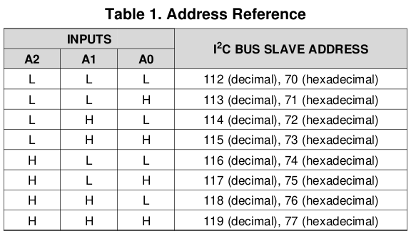
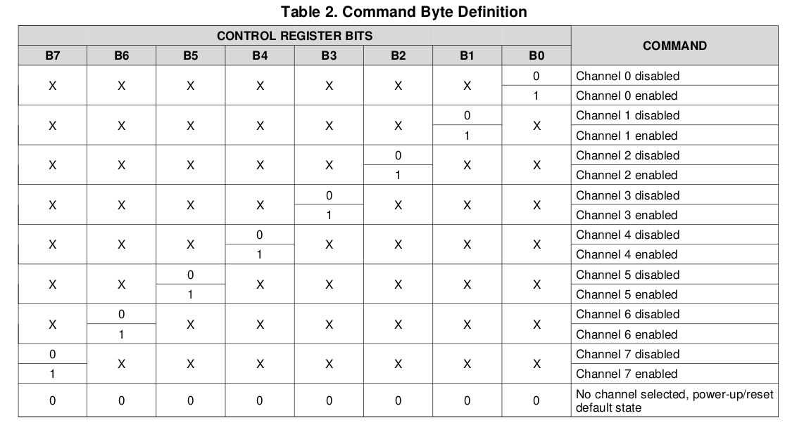
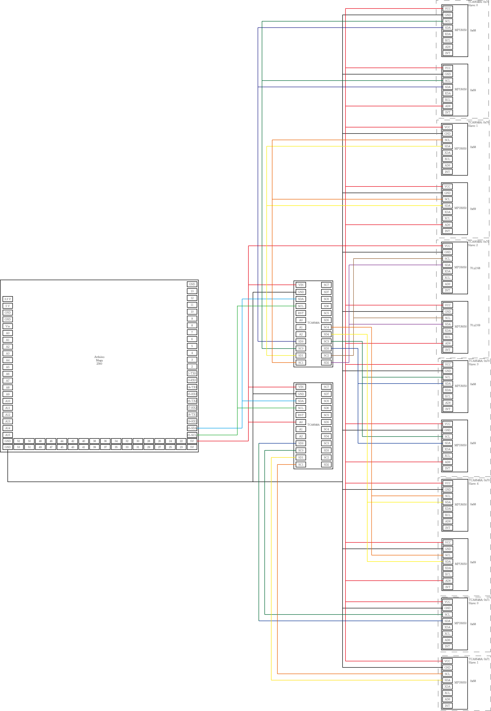
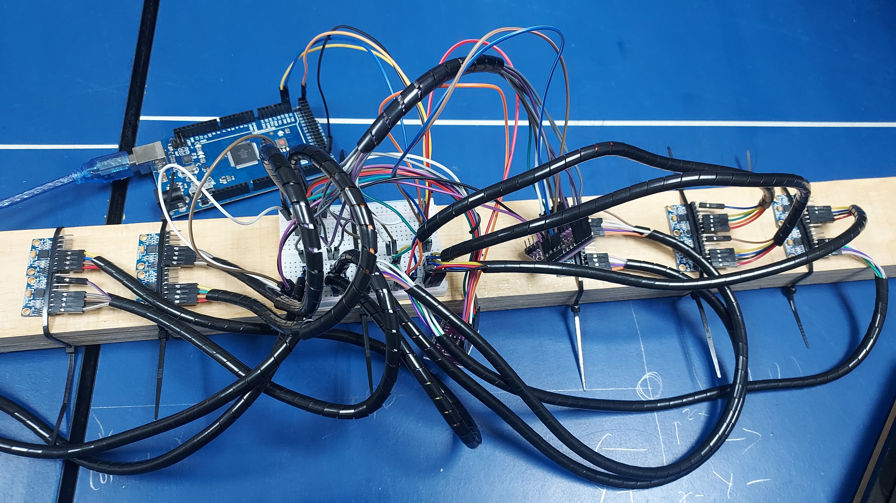
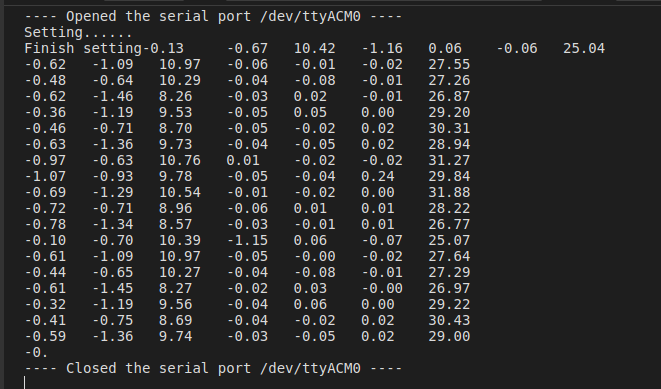

# 多三軸加速度陀螺儀 Multi Accelerometer and Gyroscope Sensor
## 目的
在 Arduino 上接多個MPU6050。
## 方法
### MPU6050
MPU6050是三軸加速度陀螺儀，可以測量三軸加速度、角速度、溫度，並且可以透過I2C讀取數值。其模組造型如下圖：


三軸加速度方向與陀螺儀方向如下圖：



其測量的原理可以理解為一顆球在一個箱子裡，這顆球被彈簧固定在箱子的中心，當箱子受到外力時，球會受到彈簧的拉力，這個拉力就是加速度，而箱子的角度就是角速度，透過這樣的方式，就可以測量出加速度和角速度。




會用到的接腳有：VCC、GND、SCL、SDA、AD0，VCC可以接5V或3.3V，GND接地，SCL和SDA接I2C，AD0接地或VCC，用來設定I2C位址，如果接地(LOW)則位址為0x68，如果接VCC(HIGH)則位址為0x69。

本次使用的Library為Adafruit MPU6050(https://github.com/adafruit/Adafruit_MPU6050)

### I2C 
I2C全名 Inter-Integrated Circuits ，是一種機體電路之間的通訊協定，只需要資料線 SDA 與時脈線 SCL 就可以完成通訊，在多設備的架構中，不同於UART是一對一的方式，而是將所有設備的SDA與SCL接在一起，類似網路匯流排的概念，其中也與網路相同，需要透過「定址」來完成資料的傳輸，在此稱之為「 I2C Address 」，其使用7 bits來記錄，也就是範圍從0到127。在網路中，如果兩台設備具備相同的IP，則無法進行有效的資料傳輸，I2C也一樣，每台設備的 I2C Address 都必須不同，然而在此案例中， MPU6050 只有提供兩個 I2C Address，因此無法簡單的直接連上超過兩台 MPU6050 ，如果是Arduino 接 Arduino，則能透過寫程式的方式更改I2C Address，但MPU6050的I2C Address已經被寫死在硬體上，無法做變更，面對這種情況，可以使用的方法有有兩種，一種是利用不斷改變 MPU6050 的 I2C Address來達到目的，例如今天有三台MPU6050，分別取名叫做 mpu0、mpu1、mpu2，則能將mpu0 的 I2C Address設為0x68，剩下兩台設為0x69，如此便能有效的與mpu0溝通，等到需要與mpu1溝通時，再將mpu0的I2C Address設為0x69，mpu1設為0x68，如此交互更換I2C Address，Arduino就能與匯流排上所有的設備溝通，除了這個方法外，也能透過下面將提及的I2C擴充器來達到目的。

### TCA9548A
TCA9548A是一種I2C擴充器，其上有VIN(可以使用3V~5V)、GND、SDA、SCL、A0~A2、SD0~SD7、SC0~SC7。



首先，TCA9548A本身就是一台I2C設備，所以具備I2C Address，提供的I2C位置範圍從0x70到0x77，控制方法是利用A0~A2接腳，三個接腳，也就是3 bits，透過接VCC(HIGH/1)或接GND(LOW/0)，組合出8種不同的I2C Address。



有了I2C Address，再搭配SDA、SCL，TCA9548A就能在I2C Bus上運作。為了要能控制多個MPU6050重複I2C Address的問題，MPU6050的SDA、SCL不是直接接到I2C Bus上，而是先接到TCA9548A的SD與SC，要接到0或7沒有關係，記得若是接到SD0，SC就要接到SC0，其他以此類推，在此，我們先將SD0與SC0稱為slave 0 、SD1與SC1稱為slave 1，後面以此類推，總共到slave 7 ，接好後，我們能透過傳訊號給TCA9548A，讓他控制現在是要使用哪一個slave，例如要使用slave 0，就傳送0給TCA9548A，他就會只與slave 0 上的I2C 裝置互動，其他slave上的裝置不會有影響，如此的好處是，如果有兩個MPU6050的Address都是0x68，則能夠一個裝在slave 0 ，另一個裝在slave 1 ，透過傳送0或1給TCA9548A，就能有效的與兩個MPU6050溝通。



> 你可能會注意到，這個方法與上面提到的不斷切換I2C Address的概念是類似的，只是一個是不斷切換Address，一個是不斷切換Slave，執行概念是類似的。

由於一次只會與一個slave溝通，而每一個slave都是與原本的I2C bus相通，所以上面也能放置I2C Address 0~127 的設備，除了0x70~0x77被TCA9548A佔去，剩下的Address都能使用，所以一個slave 能夠接兩個MPU6050，分別使用0x68與0x69，而一顆TCA9548A有八個Slave，再不考慮執行速度與「供電問題」的情況下，理論上可以接16個MPU6050，加上一台Arduino可以接八顆TCA9548A，所以一台Arduino應能夠接128顆MPU6050。
但在實際執行上，當I2C bus上若有多顆TCA9548A，會遇到TCA9548A_0x70的 Slave 0 的 MPU6050_0x68機與TCA9548A_0x71的slave 0 的MPU6050_0x68撞相同Address的問題，在此我的作法是，將TCA9548A的其中一個Slave空下來(例如Slave 7 )，當沒有要使用某TCA9548A上的設備時，就將其控制Slave設到7，如此就不會產生碰撞的問題。
## 程式碼
```Arduino
#include<Adafruit_MPU6050.h>
#include<Adafruit_Sensor.h>
#include<Wire.h>

Adafruit_MPU6050 mpu0;
Adafruit_MPU6050 mpu1;
Adafruit_MPU6050 mpu2;
Adafruit_MPU6050 mpu3;
Adafruit_MPU6050 mpu4;
Adafruit_MPU6050 mpu5;
Adafruit_MPU6050 mpu6;
Adafruit_MPU6050 mpu7;
Adafruit_MPU6050 mpu8;
Adafruit_MPU6050 mpu9;
Adafruit_MPU6050 mpu10;
Adafruit_MPU6050 mpu11;

void setup(){
    Serial.begin(9600);
    Wire.begin();

    Serial.println("Setting......");
    tcaSwitch(0x70, 0);
    tcaSwitch(0x71, 7);
    mpuSetup(&mpu0, 0x68);
    mpuSetup(&mpu1, 0x69);
    tcaSwitch(0x70, 1);
    mpuSetup(&mpu2, 0x68);
    mpuSetup(&mpu3, 0x69);
    tcaSwitch(0x70, 2);
    mpuSetup(&mpu4, 0x68);
    mpuSetup(&mpu5, 0x69);
    tcaSwitch(0x70, 3);
    mpuSetup(&mpu6, 0x68);
    mpuSetup(&mpu7, 0x69);
    tcaSwitch(0x70, 4);
    mpuSetup(&mpu8, 0x68);
    mpuSetup(&mpu9, 0x69);
    tcaSwitch(0x70, 7);
    tcaSwitch(0x71, 0);
    mpuSetup(&mpu10, 0x68);
    tcaSwitch(0x71, 1);
    mpuSetup(&mpu11, 0x68);
    Serial.print("Finish setting");
}

void loop(){
    sensors_event_t a_0, a_1, a_2, a_3, a_4, a_5, a_6, a_7, a_8, a_9, a_10, a_11;
    sensors_event_t g_0, g_1, g_2, g_3, g_4, g_5, g_6, g_7, g_8, g_9, g_10, g_11;
    sensors_event_t t_0, t_1, t_2, t_3, t_4, t_5, t_6, t_7, t_8, t_9, t_10, t_11;

    tcaSwitch(0x70, 0);
    tcaSwitch(0x71, 7);
    mpu0.getEvent(&a_0, &g_0, &t_0);
    mpu1.getEvent(&a_1, &g_1, &t_1);
    tcaSwitch(0x70, 1);
    mpu2.getEvent(&a_2, &g_2, &t_2);
    mpu3.getEvent(&a_3, &g_3, &t_3);
    tcaSwitch(0x70, 2);
    mpu4.getEvent(&a_4, &g_4, &t_4);
    mpu5.getEvent(&a_5, &g_5, &t_5);
    tcaSwitch(0x70, 3);
    mpu6.getEvent(&a_6, &g_6, &t_6);
    mpu7.getEvent(&a_7, &g_7, &t_7);
    tcaSwitch(0x70, 4);
    mpu8.getEvent(&a_8, &g_8, &t_8);
    mpu9.getEvent(&a_9, &g_9, &t_9);
    tcaSwitch(0x70, 7);
    tcaSwitch(0x71, 0);
    mpu10.getEvent(&a_10, &g_10, &t_10);
    tcaSwitch(0x71, 1);
    mpu11.getEvent(&a_11, &g_11, &t_11);

    printAccGyo(&a_0, &g_0, &t_0);
    printAccGyo(&a_1, &g_1, &t_1);
    printAccGyo(&a_2, &g_2, &t_2);
    printAccGyo(&a_3, &g_3, &t_3);
    printAccGyo(&a_4, &g_4, &t_4);
    printAccGyo(&a_5, &g_5, &t_5);
    printAccGyo(&a_6, &g_6, &t_6);
    printAccGyo(&a_7, &g_7, &t_7);
    printAccGyo(&a_8, &g_8, &t_8);
    printAccGyo(&a_9, &g_9, &t_9);
    printAccGyo(&a_10, &g_10, &t_10);
    printAccGyo(&a_11, &g_11, &t_11); 
}

void tcaSwitch(int tca_num, uint8_t tca_slave){
    if(tca_slave > 7){
        return;
    }
    Wire.beginTransmission(tca_num);
    Wire.write(1 << tca_slave);
    Wire.endTransmission();
    return;
}

void mpuSetup(Adafruit_MPU6050 *mpu, uint8_t i2c_addr){
    if((mpu->begin(i2c_addr)) == false){  
    Serial.println("Failed to setup mpu");
    while(1){
        delay(10);
      }
   }
    mpu->setAccelerometerRange(MPU6050_RANGE_2_G);
    mpu->setGyroRange(MPU6050_RANGE_250_DEG);
    mpu->setFilterBandwidth(MPU6050_BAND_21_HZ);
}

void printAccGyo(sensors_event_t *a, sensors_event_t *g, sensors_event_t *t){
    Serial.print(a->acceleration.x);
    Serial.print("\t");
    Serial.print(a->acceleration.y);
    Serial.print("\t");
    Serial.print(a->acceleration.z);
    Serial.print("\t");
    Serial.print(g->gyro.x);
    Serial.print("\t");
    Serial.print(g->gyro.y);
    Serial.print("\t");
    Serial.print(g->gyro.z);
    Serial.print("\t");
    Serial.println(t->temperature);
}
```

## 使用方法
### 組裝圖

### 實際組裝圖

## 畫面
當程式碼上傳到Arduino 後，打開Serial monitor就會出現下面畫面，每一row為一顆mpu6050，每一column從左至右依序為x、y、z軸的加速度、角速度、溫度。


